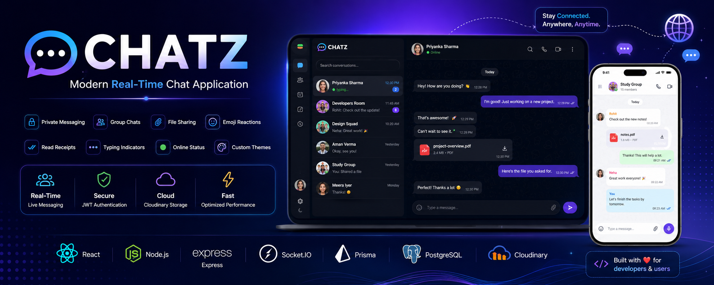
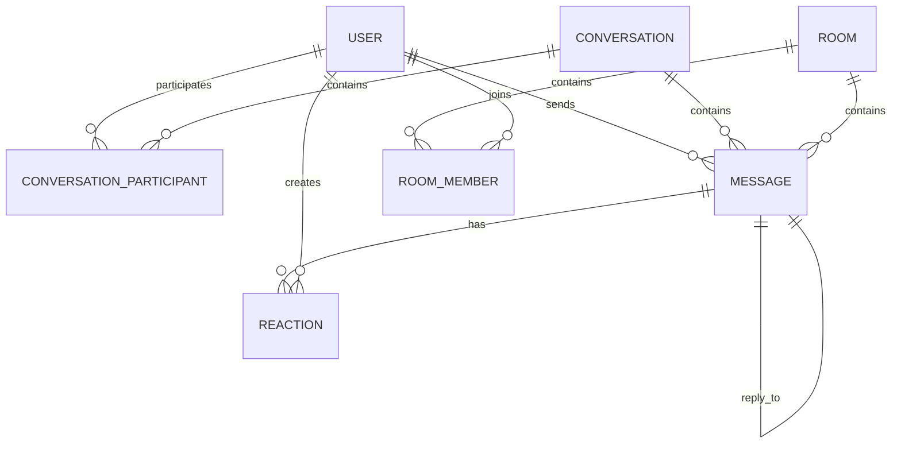

# 💬 CHATZ – Modern Real-Time Chat Application

<p align="center">
  
</p>

<p align="center">
  <h3 align="center">🚀 Connect. Chat. Stay Together.</h3>
  <p align="center">
    A full-stack real-time messaging platform built with React, Node.js, Express, Socket.IO, Prisma, PostgreSQL, and Cloudinary.
  </p>
</p>

---

<p align="center">


</p>

---

# 📖 About the Project

**CHATZ** is a modern, scalable, full-stack real-time messaging platform designed to deliver a seamless communication experience for individuals and groups.

The application combines **REST APIs** with **Socket.IO WebSockets** to provide instant message delivery, typing indicators, online presence tracking, read receipts, and real-time synchronization across multiple devices.

Built using modern web technologies and industry best practices, CHATZ focuses on performance, security, and scalability while maintaining a clean, responsive user interface.

---

## 🌟 Highlights

- 💬 Real-Time Private Messaging
- 👥 Group Chat Rooms
- ⚡ Instant Message Delivery
- 🟢 Live Online/Offline Status
- ⌨️ Typing Indicators
- ✅ Read Receipts
- 📷 Image Sharing
- 📁 File Sharing
- 😀 Emoji Reactions
- 🔍 User Search
- ☁️ Cloudinary Media Storage
- 🔐 JWT Authentication
- 🛡 Protected Routes
- 📱 Fully Responsive UI
- ⚙️ REST API + Socket.IO Architecture

---

# 🎯 Project Goals

The objective of CHATZ is to demonstrate the implementation of a production-style messaging platform using a modern JavaScript technology stack.

This project showcases:

- Authentication & Authorization
- RESTful API Design
- WebSocket Communication
- Real-Time Event Handling
- PostgreSQL Database Design
- Prisma ORM
- Responsive React Frontend
- Secure Backend Architecture
- Cloud Media Management
- Modern UI/UX Design

---

# 🚀 Live Demo

### 🌐 Frontend

> https://chatz-silk.vercel.app

### ⚙️ Backend API

> https://chatz-cgvo.onrender.com

---

# 👨‍💻 Developer

**Pranai Sai**

B.Tech Graduate | Full Stack Developer

GitHub:
https://github.com/Pranai07

---
# ✨ Features

## 💬 Messaging

- 🚀 Real-time one-to-one messaging
- 👥 Group conversations
- 📩 Instant message delivery using Socket.IO
- ✍️ Typing indicators
- ✅ Read receipts
- 🗑️ Delete messages
- 📝 Edit messages
- 😊 Emoji support
- 📷 Image sharing
- 📁 File sharing
- 📌 Message timestamps

---

## 👤 User Management

- Secure Registration
- JWT Authentication
- Login / Logout
- Protected Routes
- User Profiles
- Last Seen
- Online / Offline Status
- Search Users
- Update Profile Picture

---

## 👥 Rooms

- Create Rooms
- Join Rooms
- Leave Rooms
- Room Members
- Room Chat History
- Room Information

---

## ⚡ Real-Time Features

- Live Notifications
- Instant Message Updates
- Typing Status
- Online Presence
- Socket.IO Rooms
- Live Conversation Updates
- Auto Refresh Without Reloading

---

## ☁ Media Support

- Cloudinary Image Upload
- Cloudinary File Storage
- Secure Media URLs
- Optimized Image Delivery

---

# 🛠 Tech Stack

| Category | Technologies |
|-----------|--------------|
| Frontend | React 19, Vite, Axios, React Router DOM |
| Backend | Node.js, Express.js |
| Database | PostgreSQL |
| ORM | Prisma |
| Real-Time | Socket.IO |
| Authentication | JWT, bcrypt |
| File Storage | Cloudinary |
| Styling | CSS3 |
| Version Control | Git & GitHub |
| Deployment | Vercel, Render |
| Package Manager | npm |

---

# 📊 Project Statistics

| Feature | Status |
|---------|--------|
| Authentication | ✅ |
| Private Chat | ✅ |
| Group Chat | ✅ |
| Socket.IO | ✅ |
| PostgreSQL | ✅ |
| Prisma ORM | ✅ |
| Image Upload | ✅ |
| File Upload | ✅ |
| Read Receipts | ✅ |
| Typing Indicator | ✅ |
| Online Status | ✅ |
| Protected Routes | ✅ |
| Responsive UI | ✅ |
| REST API | ✅ |
| Cloudinary Integration | ✅ |

---

# 📦 Major Dependencies

### Frontend

```text
React
Vite
Axios
React Router DOM
Socket.IO Client
```

### Backend

```text
Express
Socket.IO
Prisma
PostgreSQL
JWT
bcrypt
Cloudinary
cookie-parser
dotenv
multer
```

---

# 🏆 Key Highlights

- ⚡ Fully Real-Time Messaging Platform
- 🔐 Secure JWT Authentication
- 🟢 Live User Presence
- 📷 Cloud Media Uploads
- 💬 Private & Group Messaging
- 📱 Responsive Modern UI
- ☁ Cloud Deployment
- 🏗 Clean MVC Architecture
- 🗄 PostgreSQL + Prisma ORM
- 🌐 Production Ready REST API

---

# 📈 Project Overview

| Metric | Value |
|---------|-------|
| Frontend | React + Vite |
| Backend | Express.js |
| Database | PostgreSQL |
| ORM | Prisma |
| APIs | REST |
| Real-Time Engine | Socket.IO |
| Authentication | JWT |
| Storage | Cloudinary |
| Deployment | Vercel + Render |
| Architecture | Client–Server |

---
# 📂 Project Structure

```text
CHATZ
│
├── assets
│   └── banner.png
│
├── client
│   ├── public
│   ├── src
│   │   ├── assets
│   │   ├── components
│   │   │   ├── chat
│   │   │   ├── common
│   │   │   ├── rooms
│   │   │   └── sidebar
│   │   │
│   │   ├── context
│   │   ├── hooks
│   │   ├── pages
│   │   ├── services
│   │   ├── utils
│   │   ├── App.jsx
│   │   └── main.jsx
│   │
│   └── package.json
│
├── server
│   ├── prisma
│   ├── src
│   │   ├── config
│   │   ├── controllers
│   │   ├── middleware
│   │   ├── routes
│   │   ├── socket
│   │   ├── services
│   │   ├── utils
│   │   ├── app.js
│   │   └── server.js
│   │
│   └── package.json
│
├── README.md
└── .gitignore
```

---

# 🏗 Application Architecture

```
                ┌──────────────────────┐
                │      React Client     │
                │      (Vite + Axios)   │
                └──────────┬────────────┘
                           │
                 HTTP REST │ WebSocket
                           │
          ┌────────────────▼────────────────┐
          │       Express.js Server          │
          │                                 │
          │  Authentication (JWT)           │
          │  REST APIs                      │
          │  Socket.IO                      │
          │  Controllers                    │
          │  Services                       │
          └──────────────┬──────────────────┘
                         │
             Prisma ORM  │
                         │
                ┌────────▼────────┐
                │   PostgreSQL     │
                └──────────────────┘
                         │
                         │
               Cloudinary Storage
                         │
               Images & File Uploads
```

---

# 🧱 MVC Architecture

```
Client (React)
      │
      ▼
Routes
      │
      ▼
Controllers
      │
      ▼
Services
      │
      ▼
Prisma ORM
      │
      ▼
PostgreSQL
```

---

# 📁 Folder Explanation

## 🎨 client/

Contains the complete React frontend application.

### Main Responsibilities

- User Interface
- Authentication
- Chat Screens
- Room Management
- API Requests
- Socket.IO Client
- State Management

---

## ⚙️ server/

Contains the Express backend.

### Responsibilities

- REST APIs
- Authentication
- Authorization
- Socket.IO Server
- Database Access
- Business Logic
- File Uploads

---

## 📂 controllers/

Responsible for handling incoming requests and returning responses.

Examples:

- Auth Controller
- User Controller
- Conversation Controller
- Message Controller
- Room Controller

---

## 📂 services/

Contains business logic.

Responsible for:

- Database Operations
- Validation
- Complex Queries
- Helper Functions

---

## 📂 routes/

Defines API endpoints.

Example:

```
POST /api/auth/login
POST /api/auth/register

GET /api/users

GET /api/messages/:conversationId

POST /api/messages

POST /api/rooms
```

---

## 📂 socket/

Contains Socket.IO logic.

Handles:

- User Connection
- User Disconnection
- Typing Events
- Message Broadcasting
- Online Status
- Room Events

---

## 📂 middleware/

Responsible for

- JWT Authentication
- Error Handling
- Authorization
- Request Validation

---

## 📂 config/

Contains configuration files.

Examples

- Prisma
- Cloudinary
- Environment Config

---

# 🔄 Application Flow

```
User
   │
   ▼
React UI
   │
   ▼
Axios Request
   │
   ▼
Express Route
   │
   ▼
Controller
   │
   ▼
Service
   │
   ▼
Prisma ORM
   │
   ▼
PostgreSQL
   │
   ▼
Response
   │
   ▼
React UI Update
```

---

# ⚡ Socket.IO Event Flow

```
User A Sends Message
          │
          ▼
Socket.IO Client
          │
          ▼
Socket.IO Server
          │
          ▼
Save Message (PostgreSQL)
          │
          ▼
Emit Event
          │
          ▼
User B Receives Message Instantly
```

---

# 🛡 Security Layers

✔ JWT Authentication

✔ Password Hashing (bcrypt)

✔ Protected Routes

✔ Authentication Middleware

✔ CORS Protection

✔ Environment Variables

✔ Secure File Uploads

✔ Database Validation

---
# 🗄 Database Design

CHATZ uses **PostgreSQL** as its primary relational database with **Prisma ORM** to manage models, relationships, and queries.

The database is designed to support authentication, private messaging, group chats, reactions, attachments, and real-time communication while maintaining data integrity.

---

# 🏛 Entity Relationship Diagram (ERD)



---

# 📊 Database Models

## 👤 User

| Field | Type |
|---------|------|
| id | UUID |
| name | String |
| email | String |
| password | String |
| avatar | String |
| lastSeen | DateTime |
| createdAt | DateTime |
| updatedAt | DateTime |

---

## 💬 Conversation

| Field | Type |
|---------|------|
| id | UUID |
| createdAt | DateTime |

---

## 👥 ConversationParticipant

| Field | Type |
|---------|------|
| conversationId | UUID |
| userId | UUID |

---

## 📝 Message

| Field | Type |
|---------|------|
| id | UUID |
| senderId | UUID |
| conversationId | UUID |
| roomId | UUID |
| replyToId | UUID |
| content | Text |
| messageType | Text / Image / File |
| fileUrl | String |
| fileName | String |
| fileSize | Integer |
| isEdited | Boolean |
| isDeleted | Boolean |
| createdAt | DateTime |

---

## 😀 Reaction

| Field | Type |
|---------|------|
| id | UUID |
| emoji | String |
| messageId | UUID |
| userId | UUID |

---

## 🏠 Room

| Field | Type |
|---------|------|
| id | UUID |
| name | String |
| description | String |
| ownerId | UUID |
| createdAt | DateTime |

---

## 👥 RoomMember

| Field | Type |
|---------|------|
| roomId | UUID |
| userId | UUID |

---

# 🔄 Message Lifecycle

```text
User Types Message
        │
        ▼
Frontend Validation
        │
        ▼
REST API Request
        │
        ▼
Express Controller
        │
        ▼
Prisma ORM
        │
        ▼
PostgreSQL Database
        │
        ▼
Socket.IO Broadcast
        │
        ▼
Receiver Updates Instantly
```

---

# 📡 Socket.IO Events

## Client → Server

| Event | Description |
|---------|-------------|
| user:online | User connects |
| conversation:join | Join private conversation |
| conversation:leave | Leave conversation |
| room:join | Join room |
| room:leave | Leave room |
| typing:start | User started typing |
| typing:stop | User stopped typing |

---

## Server → Client

| Event | Description |
|---------|-------------|
| message:new | Receive new message |
| message:updated | Edited message |
| message:deleted | Deleted message |
| users:online | Online users list |
| user:last-seen-updated | Update last seen |
| typing:start | Display typing indicator |
| typing:stop | Hide typing indicator |

---

# 🌐 REST API Documentation

## 🔐 Authentication

| Method | Endpoint | Description |
|---------|----------|-------------|
| POST | `/api/auth/register` | Register a new user |
| POST | `/api/auth/login` | Login |
| POST | `/api/auth/logout` | Logout |
| GET | `/api/auth/profile` | Get logged-in user |

---

## 👤 Users

| Method | Endpoint | Description |
|---------|----------|-------------|
| GET | `/api/users` | Get all users |
| PUT | `/api/users/profile` | Update profile |
| PATCH | `/api/users/avatar` | Update avatar |

---

## 💬 Conversations

| Method | Endpoint | Description |
|---------|----------|-------------|
| POST | `/api/conversations` | Create conversation |
| GET | `/api/messages/:conversationId` | Conversation messages |

---

## 📨 Messages

| Method | Endpoint | Description |
|---------|----------|-------------|
| POST | `/api/messages` | Send message |
| PATCH | `/api/messages/:id` | Edit message |
| DELETE | `/api/messages/:id` | Delete message |
| POST | `/api/messages/reaction` | Add/remove reaction |

---

## 👥 Rooms

| Method | Endpoint | Description |
|---------|----------|-------------|
| POST | `/api/rooms` | Create room |
| GET | `/api/rooms` | Get rooms |
| PATCH | `/api/rooms/:id` | Rename room |
| DELETE | `/api/rooms/:id` | Delete room |
| POST | `/api/rooms/join` | Join room |
| POST | `/api/rooms/leave` | Leave room |

---

# ⚙️ API Response Example

### Successful Login

```json
{
  "success": true,
  "message": "Login successful",
  "user": {
    "id": "uuid",
    "name": "John Doe",
    "email": "john@example.com"
  }
}
```

---

### Error Response

```json
{
  "success": false,
  "message": "Invalid credentials"
}
```

---

# 📈 Performance Considerations

- Efficient Prisma queries
- WebSocket-based real-time updates
- Optimized state updates in React
- Cloudinary CDN for media delivery
- Hidden scrollbars for cleaner UI
- Responsive layout for desktop and mobile
- Persistent authentication using JWT