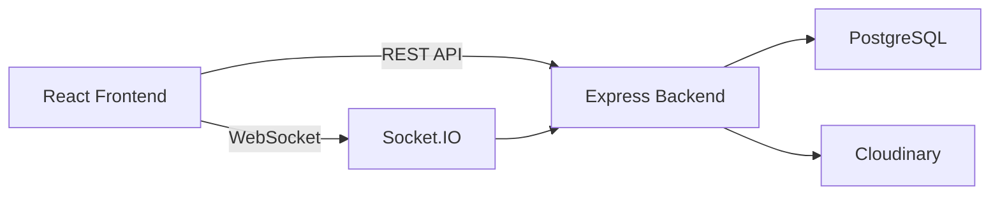
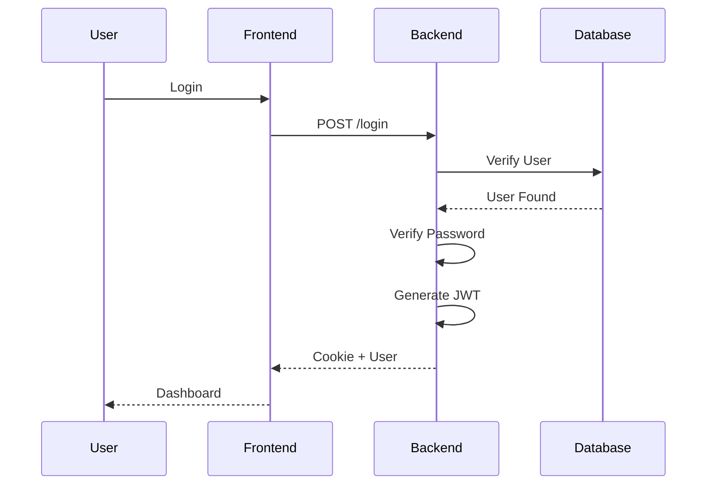
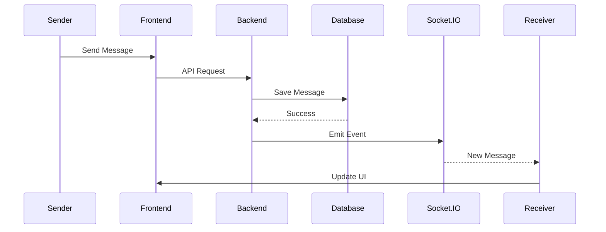
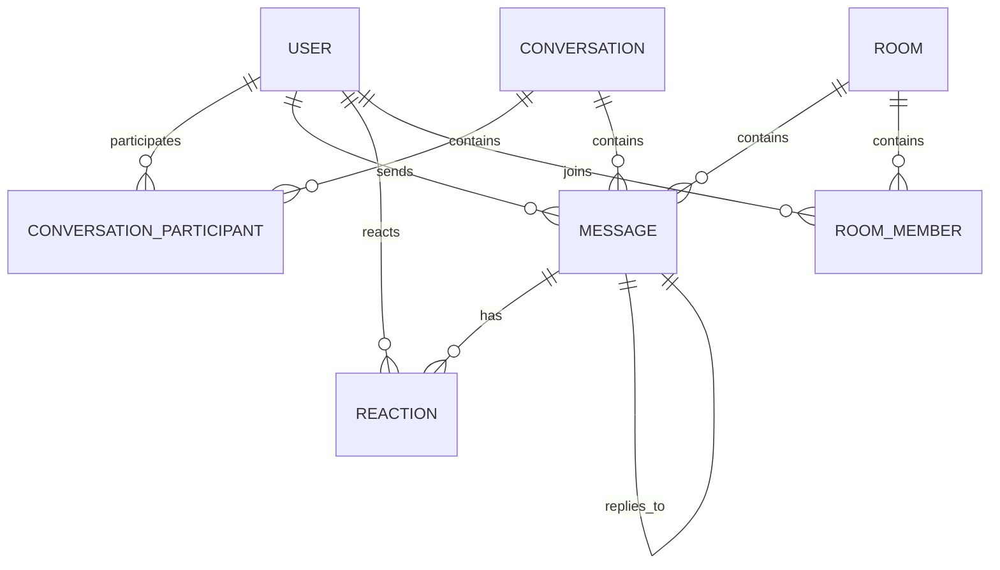
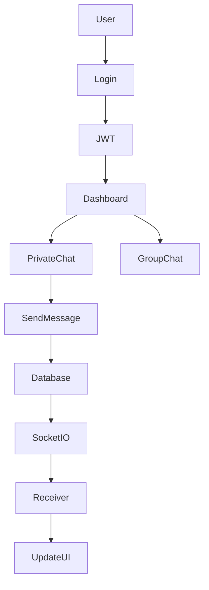
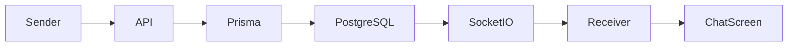
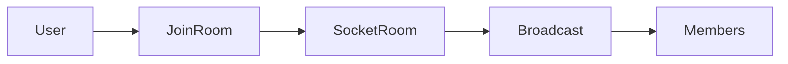
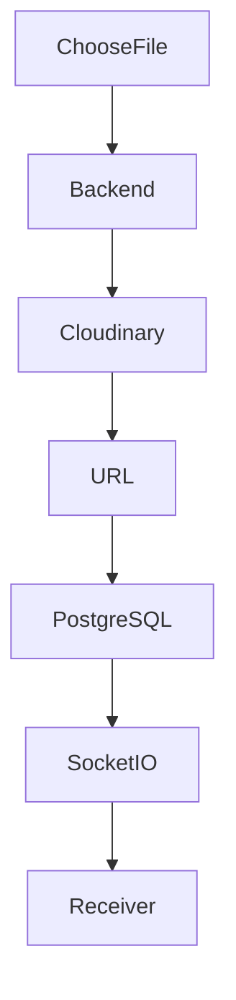
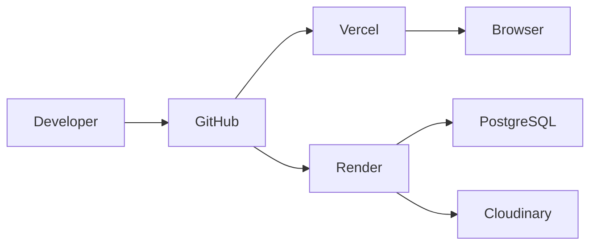

# 💬 CHATZ – Modern Real-Time Chat Application


<p align="center">
Connect. Chat. Stay Together.
</p>

<p align="center">
A secure, feature-rich real-time messaging application built with React, Node.js, Express, Socket.IO, Prisma, PostgreSQL and Cloudinary.
</p>

---

## ✨ Features
<div align="center">

# 💬 Chatz

### 🚀 A Modern Full-Stack Real-Time Chat Application

<p align="center">
Real-time messaging platform built with React, Node.js, Express, Socket.IO, Prisma, PostgreSQL and Cloudinary.
</p>

<p align="center">


</p>

<p align="center">


</p>

---

## 🌐 Live Demo

### 💻 Frontend

https://chatz-silk.vercel.app

### ⚙️ Backend API

https://chatz-cgvo.onrender.com

---

## 📸 Screenshots

> Replace these with screenshots from your application.

| Login | Register |
|-------|----------|
|  |  |

| Private Chat | Group Chat |
|---------------|------------|
|  |  |

| Light Theme | Dark Theme |
|-------------|------------|
|  |  |

---

# 📖 Table of Contents

- Introduction
- Features
- Tech Stack
- System Architecture
- Authentication Flow
- Private Chat Flow
- Group Chat Flow
- Database Schema
- Folder Structure
- REST API
- Socket Events
- Installation
- Deployment
- Security
- Performance
- Future Enhancements
- License

---

# 📌 Introduction

**Chatz** is a modern real-time messaging platform inspired by applications like WhatsApp and Discord. It provides secure one-to-one messaging, group conversations, live message delivery, typing indicators, read receipts, reactions, attachments, customizable themes, and browser notifications—all backed by a scalable Node.js and PostgreSQL architecture.

The project demonstrates modern full-stack development practices, real-time communication, responsive UI design, and production deployment using cloud platforms.

---

# ✨ Features

## 🔐 Authentication

- Secure user registration
- Secure login
- JWT Authentication
- Password hashing using bcrypt
- Protected routes
- Persistent authentication
- Secure logout

---

## 👤 User Profile

- Update display name
- Upload profile picture
- Cloudinary image storage
- Live profile updates
- Initial avatar fallback

---

## 💬 Private Messaging

- One-to-one conversations
- Real-time messaging
- Instant delivery
- Read receipts
- Delivered status
- Reply to messages
- Edit messages
- Delete messages
- Search messages
- Message timestamps
- Date separators
- Auto scrolling

---

## 👥 Group Chat

- Create rooms
- Join rooms
- Leave rooms
- Delete rooms
- Rename rooms
- View members
- Remove members
- Member count
- Real-time room updates

---

## 😀 Emoji Support

- React to messages
- Multiple reactions
- Live reaction synchronization

---

## 📎 Attachments

- Images
- PDF files
- DOC files
- DOCX files
- TXT files
- Image preview
- File preview
- File size display

---

## 🔔 Notifications

- Browser notifications
- Unread conversations
- Unread room messages
- Live updates

---

## 🌙 Personalization

- Light Theme
- Dark Theme
- System Theme
- Chat Wallpapers
- Appearance Settings

---

## ⚡ Real-Time Features

- Online status
- Last seen
- Typing indicator
- Live messaging
- Live reactions
- Live profile updates
- Live room updates

---

# 🛠 Tech Stack

## Frontend

- React 19
- Vite
- Axios
- Socket.IO Client
- React Hot Toast
- Lucide React
- CSS3

---

## Backend

- Node.js
- Express.js
- Socket.IO
- Prisma ORM
- JWT
- bcrypt
- Multer

---

## Database

- PostgreSQL
- Neon Database

---

## Cloud

- Cloudinary

---

## Deployment

- Vercel
- Render

---

# 🏗 System Architecture



---

# 🔐 Authentication Flow



---

# 💬 Private Chat Flow


# 🗄 Database Design

The application uses **PostgreSQL** with **Prisma ORM** to maintain relationships between users, conversations, rooms, messages, reactions, and attachments.

## Entity Relationship Diagram (ERD)



---

# 🧩 Database Models

## 👤 User

| Field | Type |
|---------|------|
| id | UUID |
| name | String |
| email | String |
| password | String |
| avatar | String |
| lastSeen | DateTime |
| createdAt | DateTime |
| updatedAt | DateTime |

---

## 💬 Conversation

| Field | Type |
|---------|------|
| id | UUID |
| createdAt | DateTime |

---

## 👥 ConversationParticipant

| Field | Type |
|---------|------|
| conversationId | UUID |
| userId | UUID |

---

## 📝 Message

| Field | Type |
|---------|------|
| id | UUID |
| content | String |
| messageType | Text/Image/File |
| fileUrl | String |
| fileName | String |
| fileSize | Integer |
| senderId | UUID |
| conversationId | UUID |
| roomId | UUID |
| replyToId | UUID |
| isEdited | Boolean |
| isDeleted | Boolean |
| createdAt | DateTime |

---

## 😀 Reaction

| Field | Type |
|---------|------|
| id | UUID |
| emoji | String |
| userId | UUID |
| messageId | UUID |

---

## 🏠 Room

| Field | Type |
|---------|------|
| id | UUID |
| name | String |
| description | String |
| ownerId | UUID |
| createdAt | DateTime |

---

## 👥 RoomMember

| Field | Type |
|---------|------|
| roomId | UUID |
| userId | UUID |

---

# 📂 Project Structure

```
Chatz
│
├── client
│   │
│   ├── public
│   │
│   ├── src
│   │   │
│   │   ├── assets
│   │   ├── components
│   │   │   ├── Appearance
│   │   │   ├── ChatWallpaper
│   │   │   ├── chat
│   │   │   ├── messages
│   │   │   ├── profile
│   │   │   ├── rooms
│   │   │   └── sidebar
│   │   │
│   │   ├── constants
│   │   ├── context
│   │   ├── pages
│   │   ├── services
│   │   ├── utils
│   │   ├── App.jsx
│   │   └── main.jsx
│   │
│   └── package.json
│
├── server
│   │
│   ├── config
│   ├── controllers
│   ├── middleware
│   ├── prisma
│   ├── routes
│   ├── socket
│   ├── uploads
│   ├── utils
│   ├── app.js
│   └── server.js
│
└── README.md
```

---

# 🔄 Application Flow



---

# 💬 Private Chat Flow



---

# 👥 Group Chat Flow



---

# 📎 File Upload Flow



---

# 📡 Socket.IO Events

## Client → Server

| Event | Description |
|---------|-------------|
| user:online | User connected |
| conversation:join | Join private room |
| conversation:leave | Leave private room |
| room:join | Join group room |
| room:leave | Leave group room |
| typing:start | User typing |
| typing:stop | User stopped typing |

---

## Server → Client

| Event | Description |
|---------|-------------|
| message:new | New private message |
| room:message:new | New room message |
| message:updated | Edited message |
| message:deleted | Deleted message |
| message:reaction:update | Emoji reaction |
| users:online | Online users |
| user:last-seen-updated | Last seen update |
| room:renamed | Room renamed |
| room:deleted | Room deleted |
| room:members-updated | Members changed |

---

# 🌐 REST API

## Authentication

| Method | Endpoint |
|---------|----------|
| POST | /api/auth/register |
| POST | /api/auth/login |
| POST | /api/auth/logout |
| GET | /api/auth/profile |

---

## Users

| Method | Endpoint |
|---------|----------|
| GET | /api/users |
| PUT | /api/users/profile |
| PATCH | /api/users/avatar |

---

## Conversations

| Method | Endpoint |
|---------|----------|
| POST | /api/conversations |
| GET | /api/messages/:conversationId |

---

## Messages

| Method | Endpoint |
|---------|----------|
| POST | /api/messages |
| PATCH | /api/messages/:id |
| DELETE | /api/messages/:id |
| POST | /api/messages/reaction |

---

## Rooms

| Method | Endpoint |
|---------|----------|
| POST | /api/rooms |
| GET | /api/rooms |
| PATCH | /api/rooms/:id |
| DELETE | /api/rooms/:id |
| POST | /api/rooms/join |
| POST | /api/rooms/leave |
# ⚙️ Installation Guide

## Prerequisites

Before running the project, make sure the following are installed:

- Node.js (v18 or above)
- npm
- PostgreSQL (or Neon Database)
- Git
- Cloudinary Account

---

## Clone Repository

```bash
git clone https://github.com/YOUR_USERNAME/Chatz.git

cd Chatz
```

---

# 📦 Install Dependencies

## Frontend

```bash
cd client

npm install
```

---

## Backend

```bash
cd ../server

npm install
```

---

# 🔐 Environment Variables

## Backend (.env)

```env
DATABASE_URL=

JWT_SECRET=

CLOUDINARY_CLOUD_NAME=

CLOUDINARY_API_KEY=

CLOUDINARY_API_SECRET=

PORT=5000
```

---

## Frontend (.env)

```env
VITE_API_URL=https://chatz-cgvo.onrender.com/api

VITE_SOCKET_URL=https://chatz-cgvo.onrender.com
```

---

# ▶ Running Locally

## Backend

```bash
cd server

npm run dev
```

---

## Frontend

```bash
cd client

npm run dev
```

Application will start at

Frontend

```
http://localhost:5173
```

Backend

```
http://localhost:5000
```

---

# ☁ Deployment Architecture



---

# 🚀 Production Deployment

## Frontend

Platform

```
Vercel
```

Framework

```
Vite
```

Build Command

```
npm run build
```

Output Directory

```
dist
```

---

## Backend

Platform

```
Render
```

Build Command

```
npm install && npx prisma generate
```

Start Command

```
npm start
```

---

## Database

```
Neon PostgreSQL
```

---

## File Storage

```
Cloudinary
```

---

# 🔒 Security Features

✔ JWT Authentication

✔ Password Hashing using bcrypt

✔ Secure Password Verification

✔ Protected Routes

✔ CORS Protection

✔ Helmet Middleware

✔ Environment Variables

✔ Secure Cookie Authentication

✔ SQL Injection Protection via Prisma ORM

✔ Request Validation

✔ Authentication Middleware

✔ Room Authorization

✔ Message Ownership Validation

✔ User Authorization Checks

---

# ⚡ Performance Optimizations

- Socket.IO Real-Time Communication
- Auto Scroll Management
- Browser Notification API
- Efficient React State Updates
- Duplicate Message Prevention
- Optimistic UI Updates
- Lazy Image Loading
- Cloudinary CDN Delivery
- Hidden Scrollbars
- Automatic Message Read Detection
- Delivered Message Tracking
- Optimized Database Queries
- Efficient Room Synchronization
- Automatic Theme Persistence
- Wallpaper Caching

---

# 📊 Feature Matrix

| Module | Status |
|---------|:------:|
| Authentication | ✅ |
| User Profile | ✅ |
| Private Chat | ✅ |
| Group Chat | ✅ |
| Room Management | ✅ |
| File Upload | ✅ |
| Image Preview | ✅ |
| Message Reply | ✅ |
| Edit Message | ✅ |
| Delete Message | ✅ |
| Emoji Reactions | ✅ |
| Read Receipts | ✅ |
| Delivered Status | ✅ |
| Online Status | ✅ |
| Last Seen | ✅ |
| Typing Indicator | ✅ |
| Browser Notifications | ✅ |
| Search Messages | ✅ |
| Chat Wallpapers | ✅ |
| Light Theme | ✅ |
| Dark Theme | ✅ |
| System Theme | ✅ |
| Responsive UI | ✅ |
| Cloudinary Upload | ✅ |
| PostgreSQL | ✅ |
| Prisma ORM | ✅ |
| Socket.IO | ✅ |
| JWT Security | ✅ |
| Deployment | ✅ |

---

# 📈 Scalability

The project has been designed using a modular architecture.

Future scaling can include

- Microservices
- Redis Caching
- Docker
- Kubernetes
- Nginx Reverse Proxy
- Load Balancing
- Horizontal Scaling
- Message Queue
- Email Notifications
- Push Notifications
- AI Chat Assistant

---

# 🧪 Testing Checklist

## Authentication

- Register
- Login
- Logout

---

## Private Chat

- Send Message
- Receive Message
- Edit Message
- Delete Message
- Reply
- Search

---

## Rooms

- Create Room
- Join Room
- Leave Room
- Rename Room
- Delete Room

---

## Profile

- Update Name
- Upload Avatar

---

## Attachments

- Upload Image
- Upload File
- Preview Image
- Download File

---

## Real-Time

- Typing Indicator
- Online Status
- Last Seen
- Read Receipts
- Delivered Status
- Emoji Reactions

---

# 📦 Build Statistics

Architecture

```
Client-Server
```

Communication

```
REST API + WebSockets
```

Database

```
PostgreSQL
```

ORM

```
Prisma
```

Authentication

```
JWT
```

Deployment

```
Vercel + Render
```

Storage

```
Cloudinary
```

---

# 🎯 Learning Outcomes

This project demonstrates practical experience with:

- Full Stack Web Development
- REST API Design
- Real-Time Communication
- Authentication & Authorization
- PostgreSQL Database Design
- Prisma ORM
- React Hooks
- State Management
- Socket.IO
- Cloud Deployment
- Image Upload & Storage
- Responsive UI Design
- Production Debugging
- Git & GitHub Workflow
# 🤝 Contributing

Contributions are welcome!

If you'd like to improve **Chatz**, feel free to fork the repository and submit a Pull Request.

### Steps

1. Fork the repository

2. Create your feature branch

```bash
git checkout -b feature/AmazingFeature
```

3. Commit your changes

```bash
git commit -m "Add AmazingFeature"
```

4. Push to the branch

```bash
git push origin feature/AmazingFeature
```

5. Open a Pull Request

---

# 🐞 Troubleshooting

## Socket.IO not connecting

Check

- Backend is running
- Correct Socket URL
- CORS configuration
- Render service is awake

---

## Images not uploading

Verify

- Cloudinary credentials
- Multer configuration
- File size limits

---

## Database Connection Error

Check

- DATABASE_URL
- Prisma migration
- Neon database status

---

## Authentication Issues

Verify

- JWT_SECRET
- Cookies enabled
- Protected routes
- CORS credentials

---

## Deployment Issues

Frontend

- Check Vercel Environment Variables
- Verify API URL
- Verify Socket URL

Backend

- Check Render Logs
- Verify Prisma Client Generation
- Verify Environment Variables

---

# 🚀 Future Roadmap

### Messaging

- ⭐ Star Messages
- 📌 Pin Messages
- 📤 Forward Messages
- ⏰ Schedule Messages
- 📂 Archive Chats
- 🗑 Recover Deleted Messages

---

### Calling

- 🎤 Voice Calls
- 🎥 Video Calls
- 📺 Screen Sharing

---

### AI Features

- 🤖 AI Chat Assistant
- 📝 AI Message Suggestions
- 🌐 Automatic Translation
- ✨ Smart Replies
- 😊 Emotion Detection

---

### Security

- 🔒 End-to-End Encryption
- 📱 Two-Factor Authentication
- 🔑 OAuth Login
- 🚨 Login Alerts

---

### User Experience

- 📲 Push Notifications
- 🌍 Multi-language Support
- 🎨 Custom Themes
- 📊 User Analytics
- 📈 Chat Statistics

---

# 📚 Resources

React

https://react.dev

Socket.IO

https://socket.io

Express

https://expressjs.com

Prisma

https://www.prisma.io

Neon Database

https://neon.tech

Cloudinary

https://cloudinary.com

Vercel

https://vercel.com

Render

https://render.com

---

# 📄 License

This project is licensed under the MIT License.

Feel free to use this project for learning and educational purposes.

---

# 👨‍💻 Author

## Pranai Sai

**Full Stack Developer**

### Connect with me

GitHub

https://github.com/YOUR_GITHUB_USERNAME

LinkedIn

https://linkedin.com/in/YOUR_LINKEDIN

Email

YOUR_EMAIL@gmail.com

---

# 🙏 Acknowledgements

Special thanks to

- React Team
- Express Team
- Socket.IO Team
- Prisma Team
- Neon Database
- Cloudinary
- Vercel
- Render

for providing amazing tools that made this project possible.

---

# ⭐ Show Your Support

If you found this project helpful,

please consider giving it a ⭐ on GitHub.

It helps others discover the project and motivates future improvements.

---

# 💙 Thank You

Thank you for visiting the repository.

I hope you enjoy exploring **Chatz** as much as I enjoyed building it.

Happy Coding! 🚀

---

<div align="center">

## ⭐ If you like this project, don't forget to star the repository!

Made with ❤️ using

**React • Node.js • Express • Socket.IO • Prisma • PostgreSQL • Cloudinary**

</div>